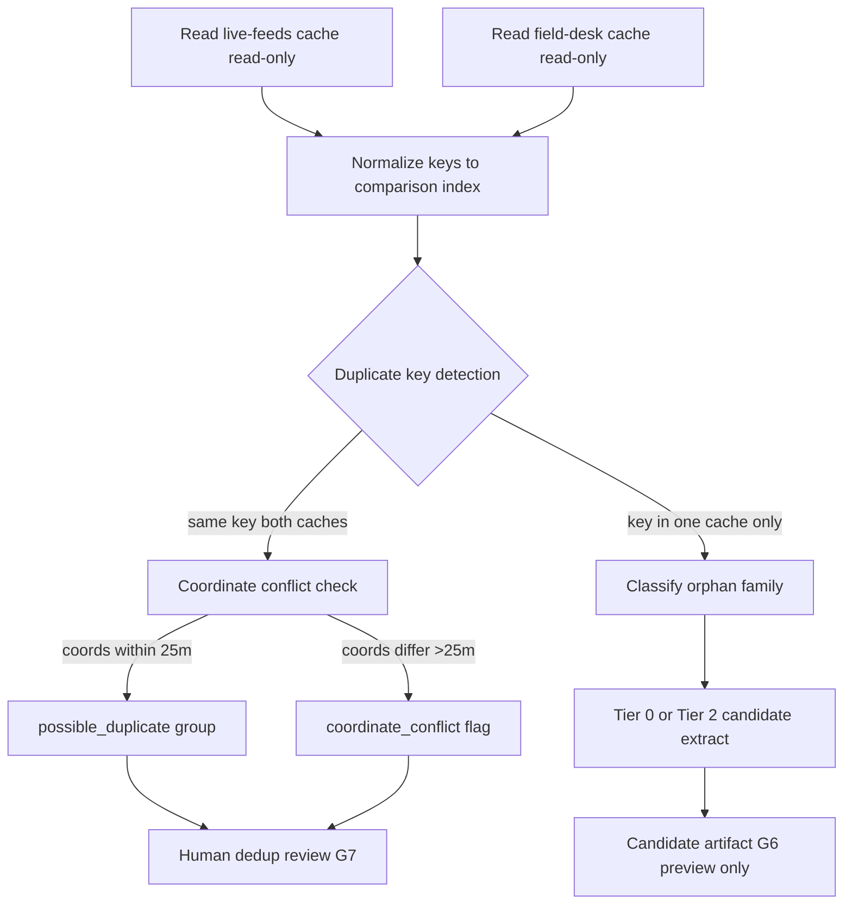

# Registry Source Inventory and Candidate Schema (XRI-G2)

Status: **report only / schema design only**. No registry database. No importers. No source data mutation.

Machine-readable report:

- `data/reports/registry_source_inventory_candidate_schema_report.json`

Schema reference:

- `docs/registry-candidate-schema.md`

Prior phases:

- XRI-G0 (`docs/master-location-registry-design.md`, PR #46 merged)
- XRI-G1 (`docs/existing-location-assets-inventory.md`, PR #47 merged)

**Design doc location:** `setoxxx/nycif-field-desk` (cross-repo reference only). Future registry storage and feed integration remain in `setoxxx/nycif-live-feeds`.

## 1. Executive summary

XRI-G1 catalogued 91 location/geocode assets across three repos and identified a critical architectural fact: **NYCIF already has two separate `location_cache.json` files** with different key spaces, purposes, and sizes. Future registry build must **reconcile and classify**, not merge blindly or rebuild from scratch.

XRI-G2 defines:

1. **Source tiers** (Tier 0–3) classifying existing assets by trust and seed eligibility
2. **Dual cache reconciliation plan** — compare safely without in-place merge
3. **Candidate registry schema** — 37-field intermediate record between sources and production registry
4. **Candidate status rules** — none production-approved at G2
5. **Conflict detection model** — for future G4/G5 extractors
6. **Parks `cpcm-i88g` feasibility** — schema-audited join strategy for Parks Events enrichment
7. **Risk carry-forward** — runtime patches and scheduled workflows flagged
8. **Future build sequence** — G3 through G11 gated roadmap

**No registry was created. No source files were modified.**

## 2. Scope and prohibitions

### In scope

- Conceptual reconciliation of dual location caches
- Source tier taxonomy tied to G1 inventory
- Candidate record schema design
- Conflict detection rules
- Missing reference documentation
- Parks dataset feasibility (3-row schema sample only)
- Future phase recommendations

### Out of scope / prohibited

| Prohibition | G2 compliance |
|---|---|
| Modify `location_cache.json` (either repo) | Not touched |
| Merge or normalize caches in-place | Design only |
| Create registry database or importer | Not created |
| Modify production feed JSON | Not touched |
| Modify public map runtime / service worker | Not touched |
| Modify WordPress / iframe / embed | Not touched |
| Modify scheduled workflows | Not touched |
| Run live staging | Not executed |
| Geocode, invent coordinates, approve matches | Not performed |
| Promote candidates to production | Blocked by design |
| Fetch large SODA datasets | 3-row sample only for schema audit |

## 3. What XRI-G1 found

| Finding | Implication for G2 |
|---|---|
| Two `location_cache.json` files (~43,522 vs ~11,211 keys) | Dual cache reconciliation required before seeding |
| live-feeds cache = event GPS memory; field-desk cache = retailer-heavy pin pipeline | Different key formats and asset families |
| 3 `should_seed_registry: yes` assets; 14 `maybe` | Tier 0/1/2 mapping |
| 642 unmatched + 249 possible tvpp rows (C5G) | Tier 3 raw/needs-review |
| Phase 2 GPS pipeline: 25 approved, Phase 2E promoted to cache | Tier 1 artifacts with reconciliation needed |
| `manual_gps_reference.json` and `nyc_parks_facility_reference.json` missing | `source_missing` status |
| `event-location-corrections-v01.js` high risk | `excluded_runtime_patch` |
| Scheduled workflows with `contents:write` | Documented; not edited |

Full asset list: `data/reports/existing_location_assets_inventory_report.json`.

## 4. Existing source tiers

Sources are **provenance inputs**, not automatic truth. Tier assignment guides future extractor behavior in G4+.

### Tier 0 — Authoritative approved/manual production geocode sources

| Source | Repo | Path | Approx scale | Seed rule |
|---|---|---|---:|---|
| Event GPS cache | live-feeds | `data/location_cache.json` | ~43,522 keys | Primary future registry home; extract as `seed_approved_candidate` after per-key provenance audit |
| Retailer/venue cache | field-desk | `data/location_cache.json` | ~11,211 keys | Secondary seed; `address_point` / `venue` candidates after dedup vs live-feeds |
| Approved major-event override | field-desk | `data/approved_major_event_geocodes.json` | 1 row | `manual_editorial_override` template |

**G2 rule:** Tier 0 candidates default to `seed_approved_candidate` only when source record has geocoded coordinates and no active conflict flags. Tier 0 ≠ production-approved.

### Tier 1 — Approved pipeline artifacts / review outputs

| Source | Repo | Path | Notes |
|---|---|---|---|
| Reviewed approval artifact | live-feeds | `data/gps_reviewed_approval_artifact.json` | 25 Howard-reviewed rows; reconcile with Phase 2E promotion report |
| Phase 2E promotion report | live-feeds | `data/gps_phase2e_promotion_report.json` | 25 cache writes claimed; artifact flags may disagree |
| C5G2 approved geocode report | field-desk | `data/reports/approved_major_event_geocodes_report.json` | Publish blocked; audit trail |
| C5G master geocode audit | field-desk | `data/reports/master_geocode_reference_audit.json` | Disposition counts; not coordinate source |
| C5P production publish report | live-feeds | `data/reports/production_feed_publish_report.json` | 1 row published; traceability reference |

**G2 rule:** Tier 1 → `seed_approved_candidate` or `needs_schema_review` depending on artifact approval flags. Never auto-seed from report JSON alone without underlying approved record.

### Tier 2 — Useful candidate/enrichment sources

| Source | Repo | Path | Registry types |
|---|---|---|---|
| Parks Event Locations | SODA | `cpcm-i88g` | `park`, `park_asset`, `venue` |
| Nightlife spots | field-desk | `data/nycif_nightlife_spots.json` | `venue`, `address_point` |
| Licensed smoke/vape retailers | field-desk | `data/nycif_licensed_smoke_vape_retailers.json` | `address_point` |
| Legal cannabis dispensaries | field-desk | `data/nycif_legal_cannabis_dispensaries.json` | `address_point` |
| Geocoding cache schema | web-platform | `data-sources/geocoding-cache.schema.json` | schema reference |
| Film permit location parser | web-platform | `scripts/film_permit_location.py` | normalization rules |
| Filled geocoding proposals | live-feeds | `data/gps_review_geocoding_filled_proposals.json` | proposed coords only |

**G2 rule:** Tier 2 → `needs_schema_review` or `seed_approved_candidate` after field mapping audit. Coordinates from enrichment files require dedup against Tier 0.

### Tier 3 — Raw / needs-review / problem sources

| Category | Examples | Default status |
|---|---|---|
| Possible matches | C5G possible_match rows, `approved_major_event_geocodes_needs_review.json` | `raw_unapproved` |
| Unmatched rows | 642 tvpp unmatched, `gps_needs_review_events.json` | `raw_unapproved` |
| Production feed outputs | `nycif_*_radar_map_events.json` | `excluded_public_feed_output` |
| Preview/prototype feeds | `preview_major_feed_needs_review.json` | `raw_unapproved` |
| Runtime patches | `event-location-corrections-v01.js` | `excluded_runtime_patch` |
| Scheduled workflow outputs | live-sync-qa committed changes | `raw_unapproved` until gated |
| Missing references | `manual_gps_reference.json`, `nyc_parks_facility_reference.json` | `source_missing` |

**G2 rule:** Tier 3 never seeds registry directly. May inform review queues in G5+.

## 5. Dual cache reconciliation plan

**Do not merge. Do not edit. Do not normalize in-place.**

### Cache comparison dimensions

| Dimension | live-feeds `location_cache.json` | field-desk `location_cache.json` |
|---|---|---|
| **source_repo** | `setoxxx/nycif-live-feeds` | `setoxxx/nycif-field-desk` |
| **Approx keys** | ~43,522 | ~11,211 |
| **Primary purpose** | Event GPS memory from tvpp/SODA pipeline | Pin-pipeline retailer/venue geocoding (nightlife, smoke/vape) |
| **Key format** | `cemsid:` / place-memory keys with borough/confidence | `normalize(location)\|normalize(borough)\|` pipe-delimited |
| **Coordinate fields** | `lat`, `lng`, often `borough`, `confidence`, `source` | `lat`, `lng`, `quality`, `provider`, `query` |
| **Approval indicators** | Phase 2E promotion metadata; `source` field | `quality: geocoded`, `provider: nyc_geosearch` |
| **Asset family** | Event locations, parks, venues from permitted events | Retail addresses, licensed venues |
| **Write scripts** | `build_gps_repository.py`, `build_location_cache.py` | `build-nightlife-pins.mjs` |
| **AGENTS.md protected** | yes | yes (field-desk AGENTS.md + G0 read-only) |

### Future safe comparison procedure (G5 — not executed in G2)

### Reconciliation outputs (future G5)

| Output | Purpose |
|---|---|
| `cache_overlap_report.json` | Keys present in both caches |
| `cache_conflict_report.json` | Same normalized key, different coordinates |
| `cache_orphan_report.json` | Keys in one cache only, by family |
| `cache_stale_report.json` | Keys with retired/superseded signals (future) |

### Candidate seeding rules from dual cache

1. **live-feeds cache entries** → default `registry_type` from key prefix and source metadata; Tier 0
2. **field-desk cache entries** → default `address_point` or `venue`; Tier 0 secondary
3. **Overlap with conflict** → both become `coordinate_conflict`; neither seeds until adjudicated
4. **Overlap without conflict** → `possible_duplicate`; merge into single candidate group in G6 review
5. **No automatic preference** for either cache; provenance must be preserved on every candidate

## 6. Candidate registry schema

Full field definitions: `docs/registry-candidate-schema.md`.

**37 fields** bridge source assets and G0 registry records:

- **Identity:** `candidate_id`, `source_repo`, `source_path`, `source_key`, `source_record_id`, `source_dataset_id`
- **Naming:** `raw_name`, `canonical_name`, `alternate_names`, `normalized_name`, `normalized_location_key`
- **Typing:** `registry_type`, `source_asset_type`
- **Geography:** `borough`, `neighborhood`, `address`, `cross_streets`, `street_name`, `from_street`, `to_street`, `park_id`, `venue_id`
- **Geometry:** `lat`, `lng`, `geometry_type`, `geometry_source`, `coordinate_quality`
- **Disposition:** `source_approval_status`, `proposed_registry_status`, `match_status`, `confidence`, `conflict_flags`, `duplicate_group_id`
- **Audit:** `provenance`, `source_last_seen_at`, `generated_at`, `notes`

Candidates are **extract artifacts**, not registry records. Production registry assigns new `registry_id` and `version` at G8 seed time.

## 7. Candidate status rules

| Status | When assigned | Can seed registry? | Can publish? |
|---|---|---:|---:|
| `seed_approved_candidate` | Tier 0/1 source with coords, no conflicts | Eligible for G8 review | **No** |
| `needs_schema_review` | Tier 2; field mapping uncertain | After G3/G4 audit | **No** |
| `possible_duplicate` | Shared normalized key or coord cluster | After dedup (G6) | **No** |
| `coordinate_conflict` | Same key, coords >25m apart | After adjudication | **No** |
| `source_missing` | Referenced file absent | Blocked | **No** |
| `raw_unapproved` | Tier 3 needs-review/raw | Blocked | **No** |
| `excluded_runtime_patch` | Runtime JS patch origin | Blocked; migrate to override | **No** |
| `excluded_public_feed_output` | Production feed row without approval chain | Blocked | **No** |
| `rejected` | Human/rule rejection | Blocked | **No** |

### Production rule (carried from G0)

Even after G8 seeding, production feed JSON requires match status `approved_exact` or `approved_source_override`. **No G2 candidate status authorizes production publish.**

## 8. Conflict detection model

Future extractors (G4) and reconciliation (G5) must evaluate:

| Conflict code | Detection rule | Default status |
|---|---|---|
| `KEY_COORD_MISMATCH` | Same `normalized_location_key`, lat/lng differ >25m | `coordinate_conflict` |
| `COORD_NAME_MISMATCH` | Same lat/lng (within 10m), different `canonical_name` | `possible_duplicate` or `needs_schema_review` |
| `VENUE_BOROUGH_AMBIGUITY` | Same venue name, different borough, no disambiguator | `coordinate_conflict` |
| `MISSING_BOROUGH` | Intersection/segment text without borough, not citywide-unique | `needs_schema_review` |
| `OVERRIDE_CACHE_CONFLICT` | Source override points to coords differing from Tier 0 cache | `coordinate_conflict` |
| `RUNTIME_PATCH_CONFLICT` | Runtime patch coords differ from source-owned cache for same event | `excluded_runtime_patch` |
| `FEED_UNTRACEABLE_COORD` | Production feed row lat/lng not traceable to Tier 0/1 approval chain | `excluded_public_feed_output` |
| `SOURCE_FILE_MISSING` | Extractor references absent file | `source_missing` |
| `STALE_SUPERSEDED` | Source record marked retired/superseded (future) | `rejected` |

### Tolerance constants (proposed)

| Check | Threshold |
|---|---|
| Coordinate equality | ≤10 meters |
| Coordinate conflict | >25 meters |
| Borough required | intersection, street_segment, address_point unless catalogued citywide-unique |

## 9. Missing references

XRI-G1 documented two files referenced in live-feeds `AGENTS.md` Phase 2C but **absent from checkout**:

| Missing path | Referenced by | Expected role |
|---|---|---|
| `data/manual_gps_reference.json` | Phase 2C geocoder fill, `build_gps_geocoding_filled_proposals.py` | Manual GPS reference coordinates for proposal fill |
| `data/nyc_parks_facility_reference.json` | Phase 2C geocoder fill | Parks facility coordinates for proposal fill |

### G2 handling (do not invent)

1. Mark all extractors referencing these files as `source_missing` until resolved
2. **Do not block G2 report** — document and proceed with schema design
3. Future G2+ follow-up actions:
   - Search prior branches/commits in live-feeds for file history
   - Confirm with Howard whether files were never committed or live elsewhere
   - If Parks reference is required, prefer fresh audit of `cpcm-i88g` over inventing replacement
4. Phase 2C fill report shows `reference_keys_loaded=0` — consistent with absence

## 10. Parks cpcm-i88g feasibility

### Dataset metadata

| Field | Value |
|---|---|
| Dataset ID | `cpcm-i88g` |
| Name | Parks Event Locations |
| Endpoint | `https://data.cityofnewyork.us/resource/cpcm-i88g.json` |
| Role | Location/map pin enrichment for Parks Events |
| Join key | `event_id` (matches Parks event feeds) |

### Schema sample (3 rows, report-only fetch)

Observed fields:

| Field | Example | Maps to candidate |
|---|---|---|
| `event_id` | `100073` | `source_record_id`; join key |
| `name` | `Audubon Center at the Boathouse` | `raw_name`, `canonical_name` |
| `park_id` | `B073` | `park_id` |
| `lat` | `40.661701...` | `lat` |
| `long` | `-73.970802...` | `lng` (normalize field name) |
| `borough` | `B`, `R`, `X` | `borough` (requires code→name map) |
| `address` | `3225 Reservoir Oval East` | `address` |
| `zip` | `10467` | notes / address enrichment |

### Borough code mapping (required for G4)

| Code | Borough |
|---|---|
| `M` | Manhattan |
| `B` | Brooklyn |
| `Q` | Queens |
| `X` | Bronx |
| `R` | Staten Island |

### Feasibility assessment

| Question | Answer |
|---|---|
| Can cpcm-i88g seed registry? | **Tier 2 maybe** — after schema audit and borough mapping |
| Join to Parks events? | **Yes** — via `event_id` |
| Production-ready? | **No** — candidates require `needs_schema_review` until audited |
| Enriched single Parks layer? | **Aligned with G0** — one enriched layer, not six public layers |
| G2 fetch scope | 3-row sample only; no bulk pull |

### Proposed candidate mapping

- `registry_type`: `park_asset` when name is facility within park; `park` when name is park-level
- `geometry_source`: `cpcm-i88g`
- `coordinate_quality`: `provisional` until human approval
- `proposed_registry_status`: `needs_schema_review` at extract time
- `source_dataset_id`: `cpcm-i88g`

## 11. Runtime patch risks

### Flagged asset

**`event-location-corrections-v01.js`** (field-desk) — client-side lat/lng override for matching event rows at map runtime.

| Risk | Detail |
|---|---|
| Hides source problems | Map shows coords not traceable to feed or cache |
| Bypasses QA gates | No `registry_id`, no approval workflow |
| Conflicts with G0 | Violates “no hidden publication” and “source adapters not map patches” |

### Future rule (not executed in G2)

1. **Do not remove** runtime patch in G2
2. **Do not edit** map runtime in G2
3. Before retirement: create equivalent `manual_editorial_override` or `source_specific_override` registry record with approved coords
4. Candidates derived from runtime patch → `excluded_runtime_patch`
5. G7+ feed integration must verify every production coord traces to Tier 0/1 source

## 12. Scheduled workflow risks

### Flagged workflows (live-feeds, inspect only)

| Workflow | Risk | Can write |
|---|---|---|
| `.github/workflows/live-sync-qa.yml` | `contents:write`; hourly | location_cache, production radar feeds |
| `.github/workflows/gps-staged-feed-integration-update.yml` | `contents:write` | staged live events |
| `.github/workflows/gps-staged-feed-integration-diagnostic.yml` | report generation | diagnostics only |
| `.github/workflows/gps-staged-feed-integration-adjudication-summary.yml` | report generation | summaries only |

### Future rule (not executed in G2)

1. **No scheduled workflow** should write registry, cache, or production feed data until registry gates exist (G8+)
2. G2 does not edit workflows
3. Workflow outputs treated as Tier 3 unless explicitly tied to approved artifact chain
4. web-platform staging writers remain local/`/tmp` only per existing contracts

## 13. Future phase roadmap

| Phase | Scope | Mode | Howard gate |
|---|---|---|---|
| **XRI-G3** | Candidate schema fixtures and validation contract | local/report only | no |
| **XRI-G4** | Read-only candidate extractor prototype | no writes to source assets | no |
| **XRI-G5** | Cache reconciliation report | no merge | no |
| **XRI-G6** | Registry candidate preview artifact | not production | no |
| **XRI-G7** | Field-desk review UI contract for candidates | admin design | no |
| **XRI-G8** | Approved registry seed PR | **approval required** | yes |
| **XRI-G9** | Preview feed integration | **approval required** | yes |
| **XRI-G10** | Production feed integration | **approval required** | yes |
| **XRI-G11** | WordPress/platform coordination | **separate approval** | yes |

G2 explicitly does **not** implement G3–G11.

## 14. Safety confirmation

| Check | Result |
|---|---|
| Registry database created | **false** |
| Importer scripts created | **false** |
| `location_cache.json` modified (either repo) | **false** |
| Production feed JSON modified | **false** |
| Public map runtime modified | **false** |
| WordPress modified | **false** |
| iframe/embed modified | **false** |
| Scheduled workflows modified | **false** |
| Live staging executed | **false** |
| Geocodes approved / candidates promoted | **false** |
| Only allowed G2 files changed in this PR | **true** |

## Next step

**XRI-G3** — Candidate schema fixtures and validation contract (local/report only): create example candidate JSON fixtures per source tier, validation rules for required fields, and extractor contract stub — still no writes to source assets.
